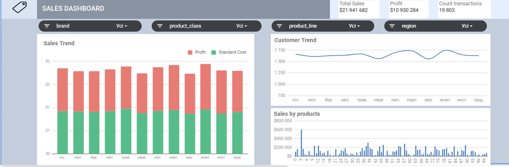
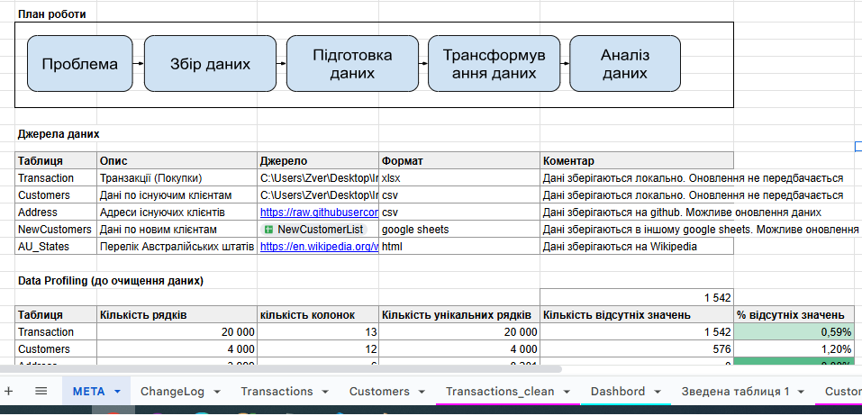

# Аналіз продажів: Інтерактивна аналітична панель в Google Sheets

Інтерактивна аналітична панель для відстеження продажів, побудована на базі Google Sheets для візуалізації та аналізу ключових показників продажів компанії.

## Огляд проекту

Проект представляє собою процес імпорту даних з різних джерел, підготовки даних, їх трасформування та розробки інтерактивної аналітичної панелі для аналізу продажів, що дозволяє фільтрувати дані за різними параметрами та відстежувати ключові показники ефективності бізнесу.

## Етапи проекту:

### 1. Імпорт даних з різних джерел

- Імпорт даних з веб-сайтів
- Імпорт даних з Excel
- Імпорт даних з CSV
- Імпорт даних з інших Google Sheets

### 2. Підготовка даних

- Data Profiling
- Очищення даних
- Забезпечення якості даних

### 3. Трансформування даних

- Використання формул
- Робота зі зведеними таблицями

### 4. Розбудова аналітичного дашборду

- Створення візуалізацій
- Налаштування інтерактивних елементів
- Підготовка звітів та дашбордів

## Структура файлу

- аркуш МЕТА - містить інформацію про план роботи, джерела інформації вихідних даних, аналіз якості даних та результпти очищення даних

- аркуші Transaction_clean, Customers_clean, Address_clean, NewCustomers_clean, AU_States містять очищені та підготовлені дані для аналізу
- аркуш Dashboard - містить візуалізацію аналізу даних: [Дашборд](https://docs.google.com/spreadsheets/d/1NRMXCEFktRtBtS9sYOJOjE6KsIio7-3jFb-pyY9Pkp8/edit?gid=955877474#gid=955877474)

## Функціональність

### Ключові показники ефективності (KPI)
- **Total Sales**: Загальна сума продажів ($21,941,682)
- **Profit**: Загальний прибуток ($10,930,284)
- **Count transactions**: Кількість транзакцій (19,803)

### Фільтри та зрізи даних
Дані можна фільтрувати за чотирма основними параметрами:
- **Brand**: Торгова марка/бренд
- **Product_class**: Клас продукту
- **Product_line**: Лінійка продуктів
- **Region**: Регіон продажів

### Візуалізації
Панель містить три основні візуалізації:

1. **Sales Trend**: Помісячна динаміка продажів з розбивкою на:
   - Profit (прибуток)
   - Standard Cost (стандартна собівартість)

2. **Customer Trend**: Динаміка кількості клієнтів за місяцями року

3. **Sales by products**: Розподіл продажів за окремими продуктами

## Технічні деталі

### Використані технології
- **Google Sheets**: Основа для зберігання даних та створення панелі
- **Google Sheets Charts**: Для створення візуалізацій
- **Data Validation**: Для створення фільтрів
- **QUERY функції**: Для обробки даних та фільтрації

## Інструкція з використання

### Доступ до панелі
1. Відкрийте посилання на Google Sheets документ
2. Перейдіть на лист "Dashboard"

### Застосування фільтрів
1. Виберіть потрібні значення з випадаючих списків фільтрів
2. Всі візуалізації автоматично оновляться відповідно до вибраних фільтрів
3. Для скидання фільтрів виберіть значення "Усі"

### Інтерпретація даних
- Порівнюйте прибуток і собівартість у графіку Sales Trend
- Аналізуйте сезонні коливання в кількості клієнтів у графіку Customer Trend
- Виявляйте найбільш продавані продукти в графіку Sales by products
